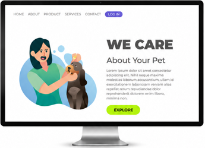
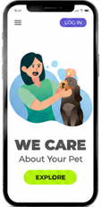

# 🐾 We Care Your Pet

## 📖 Sobre o projeto

Este projeto é uma landing page desenvolvida para um serviço de cuidados com pets.

O objetivo foi criar uma interface moderna, intuitiva e responsiva, apresentando o serviço de forma clara e proporcionando uma boa experiência ao usuário.

O projeto foi desenvolvido durante meus estudos de desenvolvimento Front-end, colocando em prática conceitos de **HTML5, CSS3, Flexbox e responsividade**.

---

## 🖥️ Preview

### 💻 Desktop

  

### 📱 Mobile

  

---

## 🚀 Tecnologias

- HTML5
- CSS3
- Flexbox
- Media Queries
- Design Responsivo

---

## 📱 Responsividade

O projeto foi desenvolvido para proporcionar uma boa experiência em diferentes tamanhos de tela.

- 🖥️ Desktop
- 💻 Tablet
- 📱 Mobile

---

## 🎯 Objetivos do projeto

- Praticar a estruturação de páginas com HTML5.
- Desenvolver layouts utilizando CSS3.
- Trabalhar com Flexbox.
- Aplicar conceitos de responsividade.
- Reproduzir um layout a partir de uma referência visual.
- Melhorar a organização e a qualidade do código.

---

## 👨‍💻 Autor

### Bruno Ajala

Desenvolvedor Front-end em formação, atualmente estudando HTML5, CSS3 e JavaScript e construindo projetos práticos para desenvolver minhas habilidades.

---

⭐ Se você gostou do projeto, considere deixar uma estrela no repositório!
